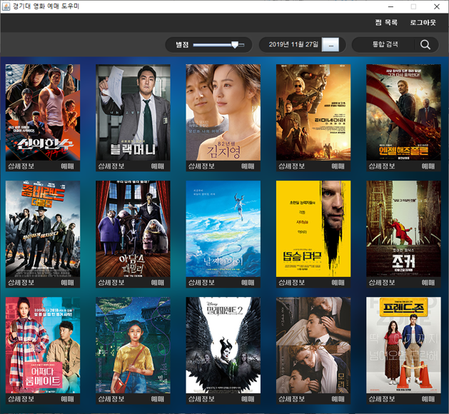
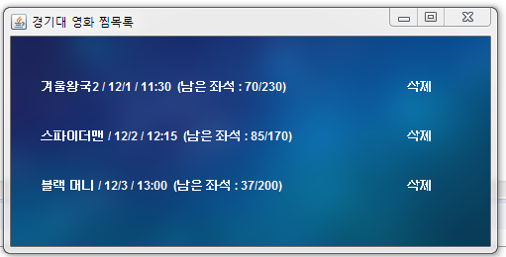
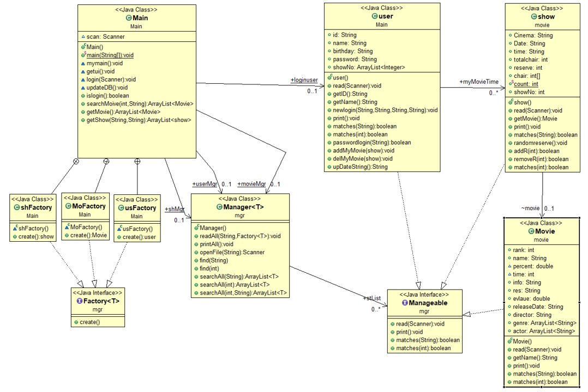

# 19-2_JAVA_OOP
2019-2 객체지향프로그래밍 term-project

# 경기대 영화 예매 도우미
## Overview
경기대학교 주변 영화관들을 한번에 검색하고 예매하도록 도와주는 프로그램이다. 대표적인 영화관 CGV, LOTTE CINEMA ,MEGABOX의 개별 홈페이지를 통해 검색하지 않도록 하나의 플렛폼으로 모아 정보를 제공한다. 또한 감독, 배우, 장르 등으로 폭넓게 영화를 검색하고 지정 시간대에 가장 가까운 시간 순으로 정렬하여 제공한다.

## 클래스 다이어그램

## Developer:

남은우, 선태욱, 이동환, 조성진
